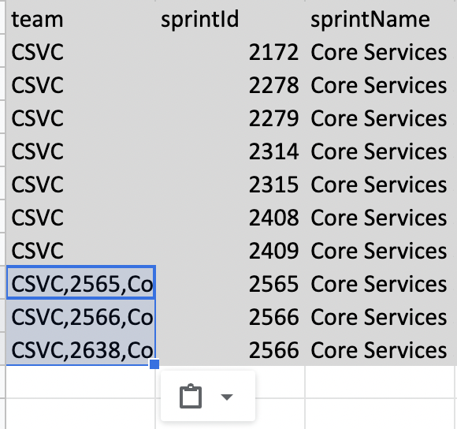
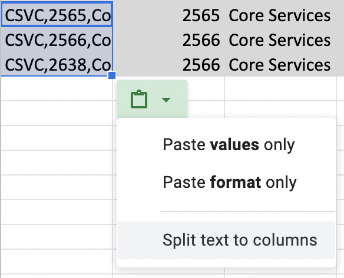
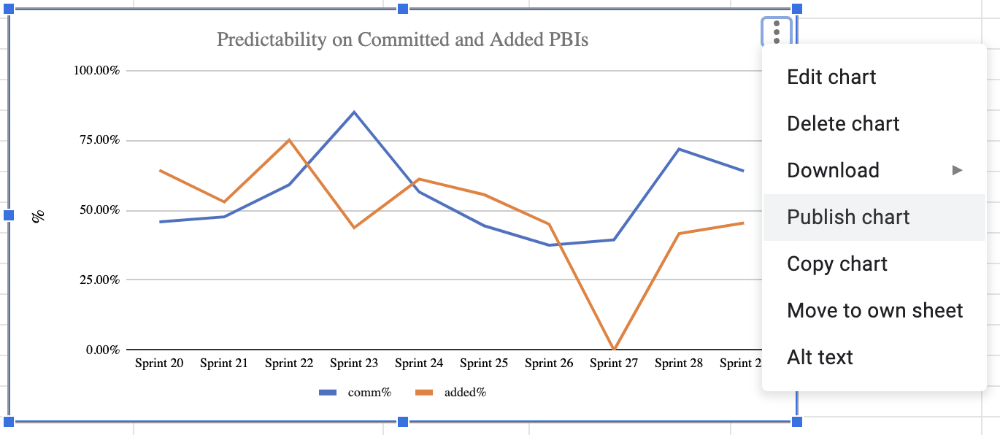
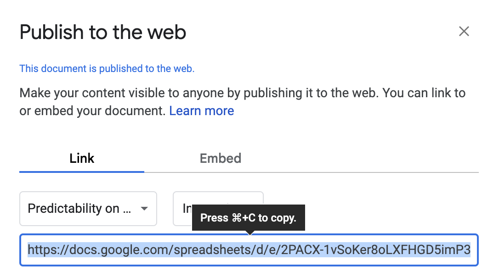
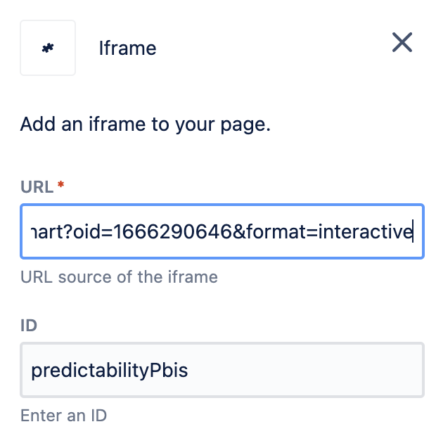
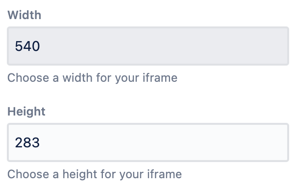
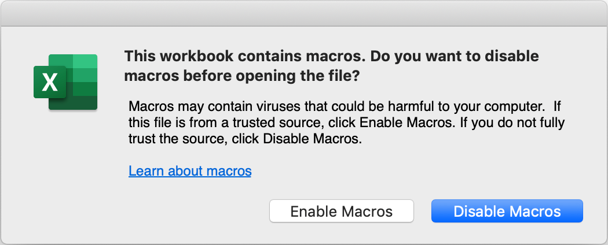
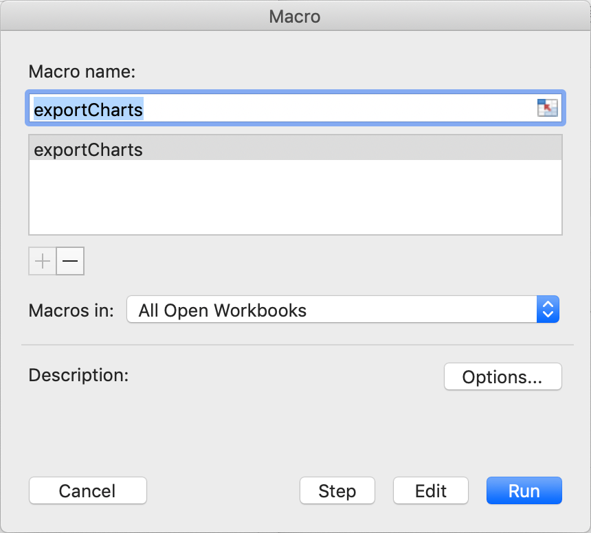
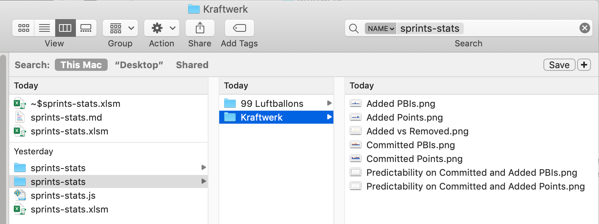

# Sprints Statistics

# Pre-requisites

## Tools
- For Windows users, go [Windows Tools Setup](windows-tools-setup.md)
- [Atlassian Jira](https://www.atlassian.com/software/jira) 
    - Tested on [Atlassian Jira](https://www.atlassian.com/software/jira) v8.5.1, might work on other versions... or not :).
    - Tested on [Atlassian Cloud](https://confluence.atlassian.com/cloud/blog/2022/03/atlassian-cloud-changes-feb-28-to-mar-7-2022) 2021~2022 versions.
- [Git](https://git-scm.com/download)

## Spreadsheet
- Microsoft Excel
  - Heavily used on Mac OS/Microsoft Office 2019 (I struggled a bit to make it working actually).
  - Debugged to make it work on Windows (our new teams use Windows laptop #5 )
- Google sheet
  - Way better options sso it's integrated via confluence

## Executing the tool
- Local setup
  - [Node.js](https://nodejs.org/en/)
    - Using v10.9.0 on Mac, I'm not using anything fancy though.
    - https://nodejs.org/en/download/
  - [brew](https://brew.sh/) (if on Mac)
- Docker setup
  - `docker` is working / Docker Desktop
    - [Docker Desktop overview](https://docs.docker.com/desktop/)
    - [Install Docker Compose](https://docs.docker.com/compose/install/)

# Purpose
## Purpose of this script
Report on the predictability of a team. It's based on PBIs and points so it should fit your practice.
Gives predictability on points and items. Gives the added and removed items of the sprints.


## Purpose from a SM Point of view
Help our teams to be engaged/aligned with the enterprise goals and sprint commitments.

## Purpose from a PO/Stakeholder Point of view
The product owner will have a fair ETA of completion.
Let's assume an Epic is 50 story points, the team velocity is 15 points per sprint, and the predictability of the team is 75% (which is very good already).
Should be 5 sprints to complete with the current velocity/effort and workload (`50/15/0.75=4.44 sprints`). 

# Install
## Clone the repo
```bash
$ git clone https://github.com/wloche/jira-tools.git
```

# A spice of configuration

## `config.js`
1. Copy `classes/config-dist.js` and renamed it to `classes/config.js`
2. Replace the values with your credentials and Jira domain name.
3. If you are using a token: just put it in the `PASSWORD`. 🔗 [API Tokens](https://id.atlassian.com/manage-profile/security/api-tokens)

```javascript
const Config = {
    /* ###### Parameters to be updated ###### */
    USER: '##USER##',
    PASSWORD: '##PASSWORD##',
    DOMAIN_NAME: 'https://##your-jira-server##',
    BASE_URL_REST_V2: '/jira/rest/api/2/',
    // f.e. Matches SPA Sprint 6
    // SPRINT_REG_EXP: /Sprint \d+/i,
    SPRINT_REG_EXP: / \d+/i,

    // How many days after you don't compute again the sprint ?
    MIN_COMPLETED_DAYS: 60,

    async: false,
    debug: false,

    teams: [
        {
            'name': '99 Luftballons',
            'boardId': 99,
        },
        {
            'name': 'Kraftwerk',
            'boardId': 2,
        },
    ],

    jira: {
        customFieldStoryPoints: 'customfield_10006',
        pointsUrl:  "/jira/rest/agile/1.0/issue/%jiraId%?fields=%customFieldStoryPoints%,issuetype",
        sprintsUrl: "/jira/rest/agile/1.0/board/%boardId%/sprint?startAt=%startAt%",
        scoreChangelUrl: '/jira/rest/greenhopper/1.0/rapid/charts/scopechangeburndownchart?rapidViewId=%boardId%&sprintId=%sprintId%',
    },
    /* ###### End of parameters section ###### */
    // [...]
}
```

- `SPRINT_REG_EXP`: `/ \d+/i` by default. Double check the sprint naming against this regular expression,
- `MIN_COMPLETED_DAYS`: `60` by default. How many days after you don't compute again the sprint ?
- `async`: whether the code is using async calls to Jira
- `debug`: whenever something wrong happens :sweat_smile:
- `teams`: list of your teams, replace accordingly
- `jira`: hopefully you'll only need to update the value for `customFieldStoryPoints`

## `sprints-stats.js`
Optionally, you can process some dedicated teams, update the constant `teams` accordingly:

```javascript
/* ###### Put the teams you want to compute or keep it blank to do them all ###### */
const teams = [ ];
// const teams = [ 'Kraftwerk' ];
/* ###### End of teams section ###### */
```

# Run
## Docker
```shell
# Build the image (once)
docker build . -t wloche/jira-tools:latest
# Install the node modules (once)
docker run -v `pwd`:/usr/src/app -it --rm wloche/jira-tools:latest npm install

# Run the scrip (each time you need!!)
docker run -v `pwd`:/usr/src/app -it --rm wloche/jira-tools:latest
```

## Locally
Install dependencies
```bash
$ npm install
```

```shell
$ node sprints-stats.js 
```

## Expected output
```shell
Discarding team 99 Luftballons

team,sprintId,sprintName,committed,committedPoints,commDone,commDonePoints,added,addedPoints,addedDone,addedDonePoints,removed,removedPoints
Kraftwerk,58550,2020 WK20,18,19,10,17,7,4,6,4,1,3
Kraftwerk,58551,2020 WK22,18,11,11,5,3,7,5,6,0,0
Kraftwerk,58552,2020 WK23,14,15,5,8,7,4,5,2,1,2
Kraftwerk,58553,2020 WK25,22,13,13,12,16,8,13,5,0,0
Kraftwerk,58554,2020 WK27,19,18,12,16,6,2,5,1,0,0
Kraftwerk,66215,2020 WK29,18,18,10,13,4,6,4,6,1,2
Kraftwerk,66216,2020 WK31,12,18,9,13,8,13,8,11,1,0
Kraftwerk,67707,2020 WK33,11,19,9,16,4,7,3,7,1,2
Kraftwerk,67708,2020 WK35,16,12,12,10,6,1,0,0,2,0
Kraftwerk,67709,2020 WK37,20,6,17,3,5,1,3,0,3,0
```

# Google Sheet
Report it to the Google Sheet, e.g. Core-CSVC-Sprints Stats.xlsm .
Goal: “Scroll-up” the last 9 rows up, then paste the results from the script.

Based on this output:
```
team,sprintId,sprintName,committed,committedPoints,commDone,commDonePoints,added,addedPoints,addedDone,addedDonePoints,removed,removedPoints
CSVC,2408,Core Services Sprint 25,27,58,12,20,18,30,10,18,0,0
CSVC,2409,Core Services Sprint 26,32,67,12,32,20,23,9,4,0,0
CSVC,2565,Core Services Sprint 27,33,59,13,26,12,19,0,0,0,0
CSVC,2566,Core Services Sprint 28,39,79,28,43,12,21,5,8,2,5
CSVC,2638,Core Services Sprint 29,25,66,16,32,11,15,5,9,1,5
```

1. select the last 9 rows, copy/paste into the first cell: 
2. copy the last 3 rows of the script
```
CSVC,2565,Core Services Sprint 27,33,59,13,26,12,19,0,0,0,0
CSVC,2566,Core Services Sprint 28,39,79,28,43,12,21,5,8,2,5
CSVC,2638,Core Services Sprint 29,25,66,16,32,11,15,5,9,1,5
```
3. and paste it to the sheet into the antepenultimate row: 
4. Use the `Split text to column` feature: 
5. Result should look like: 
6. You can also check the chart updated, refresh the confluence page to see the updates as well :tada:

## Google Sheet + Confluence tip
To publish a chart to confluence automatically, here are the steps:
1. Here is the [google sheet](https://docs.google.com/spreadsheets/d/1QpDfCxFeUb_tO5ZTH-WJvVq3uld1tTDE/edit?usp=sharing&ouid=113116956950991881861&rtpof=true&sd=true) I use, feel fre to copy it as you please!
2. Choose the chart you wish to show on the confluence page, _f.e._ `Predictability on Committed and Added PBIs`, click on the vertical `...`, then `Publish Chart`: 
3. Check the options, the permissions and copy the `URL`: 
4. Add an iframe widget on your confluence page and paste the URL: , the size (as needed): ,
5. You should have a similar result as: ,
6. These tedious steps has to be completed per each charts, but it's a one time operation! :information: I include `Predictability on Committed and Added PBIs`, `Predictability on Committed and Added Points` and `Added vs Removed` charts.

# Microsoft Excel
## Transform the CSV formatted data
I copy paste the result to text editor. Replace the commas `,` to a tabulation `\t`.
This eases the copy/paste into the Excel sheet.

## Copy to the Excel sheet
Open the [sprints-stats](../../assets/sprints-stats.xlsm).

1. Enable the Macros when prompted:

2. Spot the data range:

3. Paste the data.
I use the "Paste values" to prevent any troubles with references (you have supposedly replaced the commas `,` to a tabulation `\t`).
:information_source: When I have 10 sprints already, I "roll up the 9 sprints" and add the new one at the last position.
4. Execute the macro, click on `Views/View Macros`:
,
Then click on `Run`:
,
5. Locate the charts:
On a finder (Mac), look for `sprints-stats` name, you'll see a folder named as you team.
The charts are included:
.
6. Confluence tip:
I put the 2 `predictability` charts and `add vs removed` chart to my Sprint Review confluence page.
Sprint after sprint, I clone the page. The beauty to update the charts is to simply drag and drop them into the page (in view mode, not when editing it).

## Notes on the Excel Sheet
- :warning: Tested on Mac only / Mac Office 2019 and Windows / Office 2010
- Feel free to rename the sheet with your own team name
- If you have multiple teams, you can either use one sheet per team or duplicate the file.\
I personally prefer the latter option so I upload the file on confluence on the team's space. 
- I only keep the last 10 sprints. I don't think it's relevant to see the trend on more than 20 weeks.
If your sprints are 1 week long, you might want to see more sprints.
- :information_source: Executing the macro on a retina screen increases the chart size!

# Troubleshooting
##  Error: Cannot find module 'request-promise'
If you are having:
```shell
wilfriedloche@SO-WilfriedLoche jira-tools % docker run -v `pwd`:/usr/src/app -it --rm wloche/jira-tools:latest
node:internal/modules/cjs/loader:988
  throw err;
  ^

Error: Cannot find module 'request-promise'
Require stack:
- /usr/src/app/classes/jira.items.js
- /usr/src/app/sprints-stats.js
...
```

Run this:
```shell
docker run -v `pwd`:/usr/src/app -it --rm wloche/jira-tools:latest npm install
```

It will create the `node_modules` folder.

## `master` branch is no longer!
If you ran in the `master` branch, you need to update to `main`, proceed with the following commands:
```shell
git branch -m master main
git fetch origin
git branch -u origin/main main
git remote set-head origin -a
```
